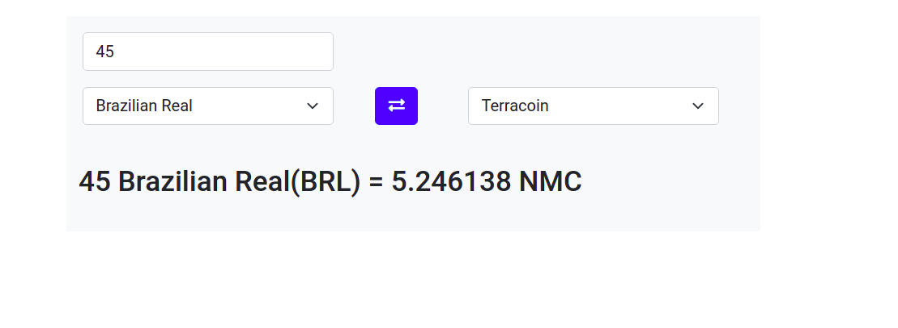

# opareta-interview
An app that converts cryptocurrencies into fiat ,

consists of a simple node proxy server and react frontend
clone repository
# server
`npm install ` for dev dependencies
`npm run Dev` to start server

# frontend
 `cd client`
 `npm install` for dev dependencies
 `npm start` to run client app

 

 
